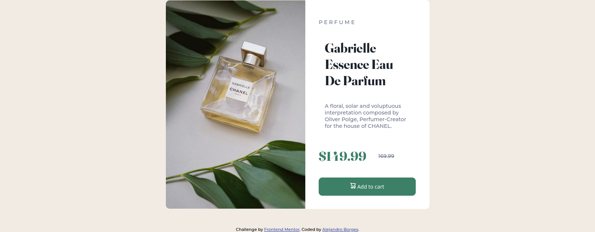
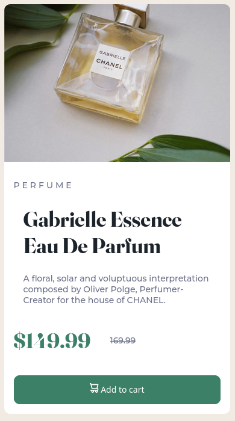

# Frontend Mentor - Product preview card component solution

This is a solution to the [Product preview card component challenge on Frontend Mentor](https://www.frontendmentor.io/challenges/product-preview-card-component-GO7UmttRfa). Frontend Mentor challenges help you improve your coding skills by building realistic projects.

## Table of contents

- [Overview](#overview)
  - [The challenge](#the-challenge)
  - [Screenshot](#screenshot)
  - [Links](#links)
- [My process](#my-process)
  - [Built with](#built-with)
  - [What I learned](#what-i-learned)
  - [Continued development](#continued-development)
  - [Useful resources](#useful-resources)
- [Author](#author)
- [Acknowledgments](#acknowledgments)

**Note: Delete this note and update the table of contents based on what sections you keep.**

## Overview

### The challenge

Users should be able to:

- View the optimal layout depending on their device's screen size
- See hover and focus states for interactive elements

### Screenshot




### Links

- Solution URL: [Code on Github](https://github.com/AlexdelCarmen/product-preview)
- Live Site URL: [Live page](https://alexdelcarmen.github.io/product-preview/)

## My process

I started building the HTML structure and getting my assets and fonts.  Next I defined CSS variables for the colors and font sizes on the project.  

To start styling I constructed the mobile layout first, I find this makes it easier to create working media queries, in this project I used only one, through which I constructed the desktop layout.
### Built with

- Semantic HTML5 markup
- CSS custom properties
- Flexbox

### What I learned

This is the first time I replace one image with another, so to speak, using a media query, I actually just added both images on the markdown and then rendered only one visible, depending on the screen size: 

```html
      
      <!-- desktop version image -->
      
```

Then I used CSS to switch between one image and the other:

```css
.desktop-image {
  display: none;
}

 .desktop-image {
    display: block;
    width: 50%;
    border-top-left-radius: 10px;
    border-bottom-left-radius: 10px;
    border-top-right-radius: 0;
  }
```


### Continued development

I still need to work on identifying the size of fonts and padding/margin when constructing a website based off of another design. 

### Useful resources

- [W3Schools](https://www.w3schools.com/) - i used W3Schools to get how to apply border radius to independent corners of an element.


## Author

- Website - [Github Profile](https://github.com/AlexdelCarmen)
- Frontend Mentor - [@AlexdelCarmen](https://www.frontendmentor.io/profile/AlexdelCarmen)
- Twitter - [@AlekBorchov](https://twitter.com/AlekBorchov)

## Acknowledgments

To the amazing and selfless people behind The Odin Project and freecodecamp, I would have never learned all of this without their help. 
